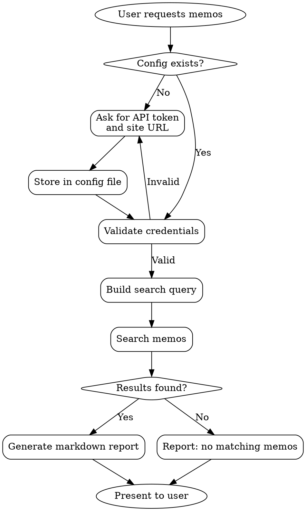

# usememos Knowledge Retrieval

## Overview

Retrieve relevant memos from user's usememos instance to support development and workflow. Read-only access to personal and public knowledge fragments.

**Core Principle:** Search user's private knowledge base, not public demo. Always require configuration before accessing API.

## When to Use

- User asks to find/search/retrieve memos
- User mentions past notes or knowledge
- User needs context from historical memos
- User references usememos or "my memos"

## Workflow



## Configuration

### Required Information

**MUST collect before any API call:**
1. **Site URL:** User's usememos instance (e.g., `https://your-memos-instance.com`)
2. **API Token:** Generated from user's account settings

**Never assume or skip configuration.** Even if user says "quickly" or "just find something", configuration is mandatory.

### Configuration File

**Location:** `~/.usememos/config.json`

```json
{
  "site_url": "https://your-memos-instance.com",
  "api_token": "your-api-token-here",
  "created_at": "2024-01-15T10:30:00Z"
}
```

**Storage:**
- First time: Prompt user, store in config file
- Subsequent times: Load from config file
- Invalid token: Re-prompt for new token

## Read-Only Operations

**Violating read-only constraint violates the skill's core purpose.**

### Allowed Operations (GET only)

- `GET /api/v1/memos` - List memos
- `GET /api/v1/memos/{id}` - Get specific memo
- `GET /api/v1/users/me` - Get current user info
- Query parameters for filtering and search

### Forbidden Operations

**NEVER use these:**
- POST (create new memo)
- PUT (update memo)
- DELETE (delete memo)
- PATCH (modify memo)

If user asks to create/modify/delete memos, refuse and explain: "This skill only reads memos. It cannot create, update, or delete them."

## Search Strategy

### Query Construction

**Good queries are specific and structured:**

1. **By tags:**
   ```
   filter: "tag == 'API'"
   filter: "tag == 'design-patterns' || tag == 'architecture'"
   ```

2. **By content:**
   ```
   Search in memo content for keywords
   Combine multiple keywords with OR logic
   ```

3. **By visibility:**
   ```
   filter: "visibility == 'PUBLIC'" (user's public memos)
   filter: "visibility == 'PRIVATE'" (user's private memos)
   ```

4. **By date:**
   ```
   orderBy: "display_time desc" (most recent first)
   ```

### Pagination

- Default `pageSize`: 50
- Maximum `pageSize`: 1000
- Use `pageToken` for next page if available
- Stop when user's intent is satisfied OR no more results

### Relevance Criteria

**A memo is "relevant" when:**
- Contains requested keywords
- Tagged with requested topics
- Mentions related concepts
- Created during relevant time period

**Order results by:**
1. Exact tag match (highest priority)
2. Keyword frequency
3. Recency (display_time desc)

## Error Handling

### Common Errors

| Error | Cause | Action |
|-------|-------|--------|
| 401 Unauthorized | Invalid/expired token | Re-prompt for API token |
| 403 Forbidden | Token lacks permissions | Explain token needs read permissions |
| 404 Not Found | Invalid site URL | Verify site URL format |
| 429 Too Many Requests | Rate limit | Wait and retry with exponential backoff |
| 500 Server Error | usememos instance issue | Suggest checking instance status |

### No Results Found

**When search returns empty:**
1. Broaden search criteria (try related terms)
2. Remove filters (try without tags)
3. Report to user with suggestions
4. Do NOT fabricate results

## Report Format

**Always generate professional markdown report.**

### Structure

```markdown
# Memo Search Report

## Query
- **Keywords:** [search terms]
- **Filters:** [applied filters]
- **Time Range:** [if specified]
- **Searched:** [timestamp]

## Results

Found N memo(s) matching your query.

### Memo 1: [Title or First Line]
**Tags:** #tag1 #tag2
**Visibility:** PUBLIC/PRIVATE
**Created:** [date]
**Link:** [site_url]/m/[memo_id]

[Content excerpt or full content if short]

---

### Memo 2: [Title or First Line]
...

## Summary

[Brief synthesis of findings - what patterns, insights, or information was found]

## No Results Alternative

If no memos found:
- Suggest related search terms
- Recommend checking tag names
- Propose broader search criteria
```

## Anti-Patterns to Block

| Rationalization | Why It's Wrong | Correct Action |
|----------------|----------------|----------------|
| "User said 'quickly'" | Speed doesn't justify skipping config | Always collect config first |
| "User said 'something relevant'" | Vague request needs clarification | Ask what's relevant to them |
| "I'll use the demo instance" | Demo != user's private knowledge | Require their site URL |
| "Why complicate things?" | Configuration is necessary | It's not complication, it's correctness |
| "They might be busy" | Assumption without asking | Ask instead of assume |
| "This should satisfy them" | Satisficing instead of solving | Get their actual memos |
| "User refuses to provide credentials" | Cannot fulfill request without access | Explain necessity, offer alternatives |
| "Maybe they don't have an instance" | Assumption about user's setup | Ask directly about their usememos usage |
| "I'll just explain how to use it" | Delays actual help | Still need config to demonstrate |

**No exceptions to configuration requirement:**
- Not for "quick demos"
- Not for "just checking"
- Not for "educational purposes"
- Not for "proof of concept"
- Not for any reason

## Red Flags - STOP and Ask

- User hasn't provided site URL → Ask for it
- User hasn't provided API token → Ask for it
- Config file doesn't exist → Create it
- Token validation fails → Re-prompt
- User asks to create/modify/delete → Refuse (read-only)
- User refuses to provide credentials → Cannot proceed, explain why

**All of these mean: Pause, clarify, configure properly.**

## When User Cannot Provide Credentials

**If user doesn't have usememos instance:**

Response:
```
I understand you don't have a usememos instance. This skill requires access to your personal memos.

Alternatives:
1. Set up usememos: https://usememos.com
2. Use a different knowledge retrieval method
3. Describe what you're looking for and I can help in other ways
```

**If user refuses to share credentials:**

Response:
```
I understand your concern about sharing credentials. However, this skill requires API access to your memos.

Security notes:
- Token is stored locally in ~/.usememos/config.json
- File permissions are restricted (chmod 600)
- You can revoke the token anytime from Settings → API Tokens
- Token only needs read permissions (no write access)

Without credentials, I cannot access your memos. Would you like to proceed with setup?
```

**NEVER:**
- Try to convince user forcefully
- Make them feel guilty for refusing
- Suggest using demo as alternative
- Store credentials insecurely

## API Reference

See [API-REFERENCE.md](API-REFERENCE.md) for detailed endpoint documentation.

### Quick Reference

| Operation | Method | Endpoint | Purpose |
|-----------|--------|----------|---------|
| List memos | GET | `/api/v1/memos` | Search/filter memos |
| Get memo | GET | `/api/v1/memos/{id}` | Retrieve specific memo |
| Get user | GET | `/api/v1/users/me` | Verify authentication |

### Request Headers

```
Authorization: Bearer <YOUR_API_TOKEN>
Content-Type: application/json
```

### Common Query Parameters

- `filter`: CEL expression to filter memos
- `pageSize`: Number of results (default 50, max 1000)
- `pageToken`: Pagination token
- `orderBy`: Sort order (default: "display_time desc")
- `state`: "NORMAL" or "ARCHIVED" (default: "NORMAL")

## Example Session

**User:** "Find memos about API design patterns"

**Agent:**
1. Check config → No config file found
2. Ask: "I need your usememos configuration:
   - What is your usememos site URL?
   - What is your API token? (Get it from Settings → API Tokens)"
3. Store in `~/.usememos/config.json`
4. Validate token via `GET /api/v1/users/me`
5. Build query: `filter: "tag == 'API' || tag == 'design-patterns'"`
6. Call `GET /api/v1/memos?filter=...`
7. Generate markdown report
8. Present to user

## Common Mistakes

| Mistake | Fix |
|---------|-----|
| Skipping config check | Always check first |
| Using demo instance | Require user's private URL |
| Modifying memos | Only GET requests |
| Vague search | Ask clarifying questions |
| No error handling | Validate and handle all errors |
| No report format | Always generate structured markdown |
